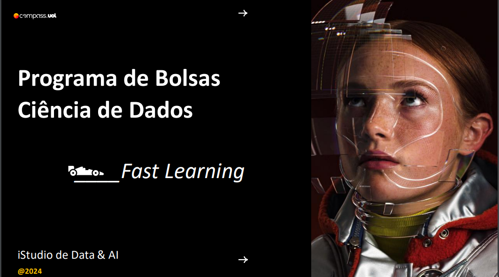

  

# Programa de Bolsa Compass.Uol Ciência de Dados

# Módulos
## [Módulo I](/Modulo%20I%20/)
### [Git](/Modulo%20I/Parte1-Git/)
  * [*`Comandos Importantes`*](/Modulo%20I/Parte1-Git/comandosGitFundamentais.md)
  * [*`Branchs`*](/Modulo%20I/Parte1-Git/branch.md)
  * [*`Meu git Page`*](https://kaladabrio2020.github.io/)
### [Sql](/Modulo%20I/Parte2-Sql/)
  * [*`Aprendendo Comandos`*](/Modulo%20I/Parte2-Sql/ComandosImportantes.md)
### [Python](/Modulo%20I/Parte3-Python)
  * [*`Comando que não tinha conhecimento`*](/Modulo%20I/Parte3-Python/comandoQueNaoSabia.ipynb)
### [PySpark](/Modulo%20I/Parte5-Spark/)
  * [*`Spark md`*](/Modulo%20I/Parte5-Spark/markdown/spark.md)
  * [*`Spark Comandos md`*](/Modulo%20I/Parte5-Spark/markdown/SparkTerminal.md)
  * [*`PySpark Aprendendo Comandos`*](/Modulo%20I/Parte5-Spark/AprendendoSpark.ipynb)
  * [*`PySpark no databricks`*](/Modulo%20I/Parte5-Spark/AprendendoNoDataBricks.ipynb)
  * [*`Spark Sql no databricks`*](/Modulo%20I/Parte5-Spark/SparkSql.ipynb)

&nbsp;
## [Módulo II]()

&nbsp;
## [Módulo III]()

cade a branch rapaz 
