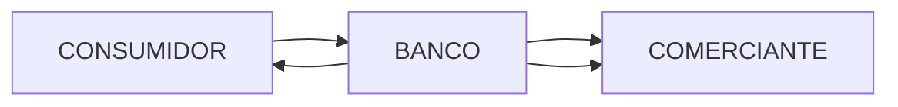
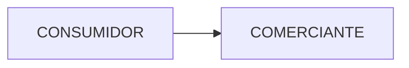

# Fraude

## Sistema de pagamentos

+ Consumidores podem ser individuos ou organizações que usam um cartão de crédito ou débito para comprar algo em um comerciantes
* Pagamentos: 
  
  * Dinheiro ou cheque
  
  * Cartão de crédito 
  
  * Cartão de débito 
  
  * Cartão pré-pagos ou presente

* **Sistema de pagamento de circuito aberto**
  
  * Tem um intermediario geralmente bancos
  
  * é um sistema financeiro que permite a utilização de cartões de pagamento (como cartões de crédito, débito ou pré-pagos) em uma ampla rede de comerciantes e serviços, tanto nacionais quanto internacionais.

* **Sistema de pagamento de circuito fechado**
  
  * Opera sem intermediarios    
  

